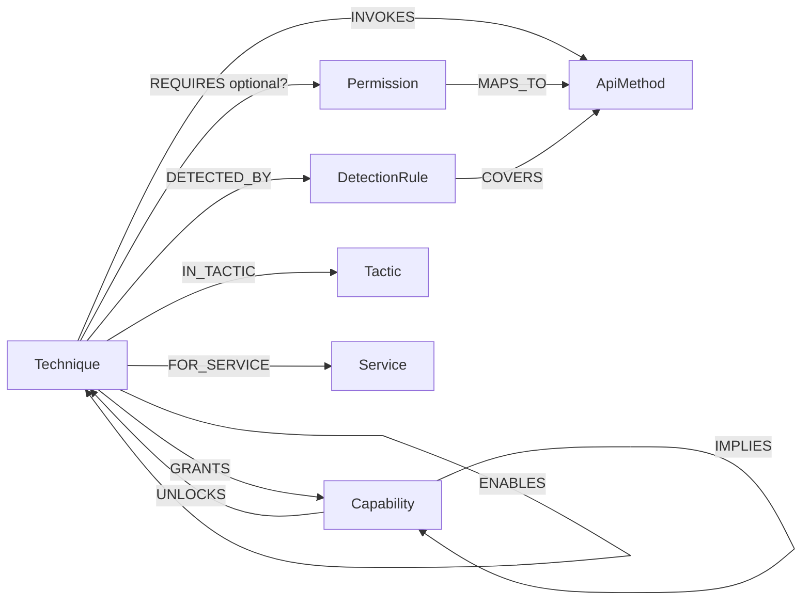

# GCP Detection-Gap Graph

Modelling GCP attack techniques and their preconditions against a signature-detection
corpus in **Neo4j**, then finding — *by graph query alone, with no ML model* — the
attack scenarios the detections cannot catch.

This is the graph-baseline for the thesis: it establishes precisely **what per-event
signatures miss**, which is the gap the model is meant to fill.

> **Full documentation is in [`docs/`](docs/README.md)** — architecture, the build pipeline,
> the graph schema, exactly how detection coverage is calculated, the findings, usage, and
> assumptions. If you're wondering why detections and techniques aren't directly wired
> together in the graph, see
> [docs/03 — how detections correlate to techniques](docs/03-graph-model.md#how-detections-correlate-to-techniques).

---

## The question

> Given the Sigma GCP detection rules we have in place, and the full set of GCP attack
> techniques (each with its IAM preconditions), which situations can the detections **not**
> figure out — discoverable purely from the graph, without a model?

## Two inputs

| Corpus | Path | What we extract |
| --- | --- | --- |
| **Detections** (Sigma) | `detections/sigma-rules/gcp/` (26 rules) | the audit-log operations each rule matches (`method_name`, `authorizationInfo.permission`, Workspace event names) |
| **Techniques** (hacktricks-cloud) | `techniques/.../gcp-security/` — 6 directories | one technique per permission-bearing heading (privesc/persistence/post-exploit) + inline-extracted perms from the discovery/unauth/workspace-pivoting pages, each with its **required IAM permissions = preconditions** |

## The core idea

A Sigma rule keys on an audit-log `methodName`. A technique is only **detectable** when an
operation it must perform is (a) **matched by a rule** *and* (b) written to a log that is
**on by default**. GCP Cloud Audit Logs split into:

- **Admin Activity** — config / IAM / metadata writes. *Always on.* A rule can see these.
- **Data Access** — reads, token minting, KMS decrypt, object/secret payloads.
  **Off by default** for almost every service. A rule never receives the event at all.

So a technique falls into exactly one bucket:

| Class | Meaning | Fix |
| --- | --- | --- |
| `DETECTED` | a matched operation is logged by default | — |
| `RULE_GAP` (A) | operation **is** logged, but **no rule** matches it | write a signature |
| `TELEMETRY_GAP` (B) | operation is Data-Access, **off by default** — *no signature can ever fire* | reconfigure logging / reason over the graph |

Because permissions, audit methodNames and Sigma strings use three incompatible notations,
everything is normalised to a canonical `service.resource.verb` operation signature
(`src/normalize.py`) before joining. The normaliser is deliberately conservative, so the
blind-spot counts are **lower bounds**.

---

## Graph schema



- **ApiMethod** carries `log_type` (`ADMIN_ACTIVITY`/`DATA_ACCESS`) and `logged_by_default`.
- **DETECTED_BY** is only created when a covered method is logged by default — the honest
  definition of "a signature would actually fire".
- **Capability** / **ENABLES** are the chaining layer (see below).

### Loaded graph (current run)

```
nodes:  Technique 254 · Permission 282 · ApiMethod 327 · DetectionRule 26 · Capability 9 · Tactic 6 · Service 34
edges:  REQUIRES 387 · MAPS_TO 282 · INVOKES 363 · COVERS 60 · DETECTED_BY 15
        GRANTS 71 · IMPLIES 7 · UNLOCKS 25 · ENABLES 1481
```

---

## Headline findings

Full report: [`out/findings.md`](out/findings.md) · machine-readable: `out/findings.json`.

**Of 254 techniques, only 15 (5.9%) are detected.** 189 are Class-A rule gaps, 50 are
Class-B telemetry gaps.

| Query | Scenario the detections miss |
| --- | --- |
| `07_blind_privesc_to_crown_jewels` | **13 undetected techniques directly hand over a crown jewel** — `resourcemanager.*.setIamPolicy` → project/org **Owner**, `iam.roles.update/create` → self-granted admin, `secretmanager.versions.access` → secrets, `cloudkms…useToDecrypt` → decryption, `iam.serviceAccountKeys.create` → a permanent exportable credential. One uncovered API call, no alert. |
| `09_invisible_impersonation` | **6 service-account impersonation primitives** (`getAccessToken`, `getOpenIdToken`, `signBlob`, `signJwt`, `implicitDelegation`, `container…createToken`) are Data-Access ops — stealing another identity produces **no log at all** in a default project. |
| `08_undetected_pivot_chains` | **Multi-hop pivot chains** (up to 4 hops) where every step is a blind spot *and* no rule reasons across hops — a `setIamPolicy` foothold walks across service accounts entirely undetected. Structurally invisible to per-event signatures. |
| `04_covered_but_unlogged` | **False comfort:** rules that exist but are blind by default because they match a Data-Access read — e.g. *Storage Buckets Enumeration* keys on `storage.buckets.list` (which is exactly the `discovery` tactic operation an attacker uses). |
| `03_telemetry_gap_classB` | The 50 techniques for which **no signature can ever help** without turning on Data Access logging. |

The detections that *do* exist cluster in GKE/container config, storage and SQL
**impact/destruction** — not in the privilege-escalation, impersonation and
credential-access operations that dominate the attack corpus (`05_rules_without_technique`,
`06_coverage_by_tactic_service`).

---

## The chaining layer (capabilities)

Per-event signatures never reason about *chains*. To express multi-step attacks purely in
the graph — no model — each technique is annotated with the **capabilities** it grants, and
capabilities unlock further techniques. All rules are deterministic and documented in
`src/mappings.py`:

- **GRANTS** — e.g. `*.setIamPolicy` on a project → `PROJECT_ADMIN`; `getAccessToken`/
  `serviceAccountKeys.create` → `IMPERSONATE_SA`; `secretmanager.versions.access` →
  `READ_SECRET`.
- **IMPLIES** — capability implications, e.g. `CODE_EXEC_AS_SA ⟹ IMPERSONATE_SA`,
  `CUSTOM_ROLE ⟹ PROJECT_ADMIN`.
- **UNLOCKS** — `IMPERSONATE_SA` satisfies the `iam.serviceAccounts.actAs` precondition of
  the deploy-as-SA techniques, so `(A)-[:ENABLES]->(B)` is materialised whenever A's
  capabilities unlock B.

Crown jewels: `PROJECT_ADMIN`, `ORG_ADMIN`, `SA_KEY_PERSIST`, `READ_SECRET`, `DECRYPT_KMS`.

---

## Run it

```bash
./run.sh            # venv + neo4j + parse + build + query  (needs Docker)
./run.sh analyze    # re-run queries only
```

Neo4j browser: <http://localhost:7474> (`neo4j` / `detgap-thesis`). Try a query from
`queries/` or:

```cypher
MATCH (t:Technique {blind_class:'TELEMETRY_GAP'})-[:GRANTS]->(c:Capability {kind:'crown_jewel'})
RETURN t.primary_perm, c.name;
```

### Layout

```
code/
  docker-compose.yml         Neo4j 5.26
  run.sh                     one-shot pipeline
  requirements.txt
  src/
    normalize.py             perm/methodName -> service.resource.verb (the join key)
    parse_sigma.py           detections/  -> data/detections.json
    parse_techniques.py      techniques/  -> data/techniques.json
    mappings.py              log-type classifier + capability model  (knowledge layer)
    build_graph.py           load nodes/edges into Neo4j
    run_queries.py           run queries/*.cypher -> out/findings.{md,json}
  queries/*.cypher           the 10 gap-analysis questions (documented headers)
  data/*.json                extracted corpora
  out/findings.{md,json}     generated report
```

---

## Assumptions & limitations

- **Detectability is defined structurally** (operation matched ∧ logged-by-default), not by
  running the rules against real logs. It answers "could this rule ever fire on this
  technique", which is the right question for a coverage gap.
- **Data Access = off by default** is applied uniformly. BigQuery Data Access is on by
  default in reality; treating it as off is conservative (it can only *over*-count gaps for
  BigQuery, a small slice).
- **The capability layer is a deterministic model of attacker reasoning**, not ground truth
  about a specific environment — we don't know which service account holds which permission,
  so `ENABLES`/`IMPLIES` encode *what is possible in principle*. The dense `ENABLES` subgraph
  reflects that any SA-impersonation capability unlocks every `actAs`-gated deploy technique.
- **Persistence is under-represented** (2 techniques): the vendored persistence pages are
  prose without permission headings, so there is little precondition data to extract.
- Coverage numbers are **lower bounds** by construction (conservative normalisation +
  "any covered+logged op ⇒ detected").
